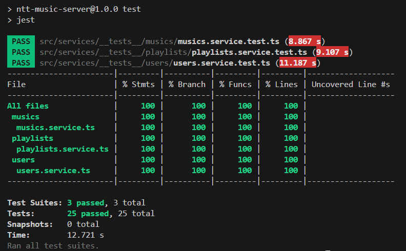

# 🎵 NttMusic Plataform - Backend

**NttMusic Platform** é uma API REST desenvolvida em Node.js com TypeScript que consome a API pública da *Deezer*, processa e manipula os dados musicais, e os armazena no banco de dados Firebase.

## Índice

- [Tecnologias Utilizadas](#tecnologias-utilizadas)
- [Pré-requisitos](#pré-requisitos)
- [Instalação e Configuração](#instalação-e-configuração)
- [Estrutura de Diretórios](#estrutura-de-diretórios)
- [Testes](#testes)
- [Autenticação](#autenticação)
- [Documentação da API](#documentação-da-api)
- [Link do Projeto Frontend](#link-do-projeto-frontend)
- [Contribuições](#contribuições)
- [Licença](#licença)

## Tecnologias Utilizadas

- **Node.js** – Ambiente de execução para JavaScript no lado do servidor.
- **TypeScript** – Superset de JavaScript que adiciona tipagem estática ao código.
- **Express.js** – Framework web para Node.js, usado para construir a API RESTful.
- **Firebase** – Banco de dados em tempo real.
- **Deezer Public APi**
- **JWT** – Para autenticação.
- **Jest** – Para testes.
- **dotenv** – Para variáveis de ambiente.
- **Tsoa** – Para socumentar a API no Swagger de forma dinâmica.

## Pré-requisitos

Antes de começar, você precisará ter os seguintes softwares instalados:

- [Node.js](https://nodejs.org) (v18 ou superior)
- [npm](https://www.npmjs.com) (gerenciador de pacotes do Node.js)
- Variáveis de ambiente.

## Instalação e Configuração

1. **Clonar o Repositório**

   Clone este repositório para o seu ambiente local:

   ```bash
   git clone https://github.com/Biiars00/nttmusic-plataform.git

   cd <seu-diretorio>

   ```

2. Instalar Dependências

   Instale as dependências necessárias:

   ```bash
   npm install

   ```

3. Configurar Variáveis de Ambiente

- Crie um arquivo `.env` na raiz do projeto com as seguintes variáveis:

  ```bash
    URL_FIREBASE_CREDENTIALS=
    JWT_SECRET_KEY=
    JWT_EXPIRES_IN=
    BACKEND_PROD=
    BACKEND_DEV=
    FRONTEND_URL_PROD=
    FRONTEND_URL_DEV=
    PORT=
    DOCKER_USERNAME=
    DOCKER_PASSWORD=
    DEEZER_API_BASE=
  ```

4. Executar o Servidor:

   ```bash
   npm run dev
   ```

## Estrutura de Diretórios

    elderly-care/
    ├── src/
    │   ├── config/
    │   ├── controllers/
    │   ├── dependencies/
    │   ├── docs/
    │   ├── gateways/
    │   ├── interfaces/
    │   ├── middlewares/
    │   ├── repositories/
    │   ├── routes/
    │   ├── services/
    │   ├── app.ts
    │   └── server.ts
    ├── .env.example
    ├── package.json
    ├── tsconfig.json
    ├── ...
    └── README.md

## Testes

Executa todos os testes:
```bash
npm run test
```

Executa testes com relatório de cobertura:
```bash
npm run test:coverage
```

Resultado esperado:



## Autenticação

A autenticação é baseada em JWT. Para acessar rotas protegidas, inclua o token no header da requisição:

```bash
Authorization: Bearer <seu_token_aqui>
```

## Documentação da API

[Swagger Doc](/docs)

## Links do Projeto Front-end

- [NttMusic Plataform - Produção]()
- [NttMusic Plataform - Github]()

## Contribuições

Contribuições são super bem-vindas! Para colaborar:
1. Faça um fork do projeto
2. Crie uma branch com sua feature: `git checkout -b feat/nova-feature`
3. Commit suas alterações: `git commit -m 'feat: nova funcionalidade'`
4. Envie para o seu fork: `git push origin feat/nova-feature`
5. Crie um Pull Request

## Licença

Este projeto está licenciado sob a [MIT License](https://opensource.org/license/mit).
